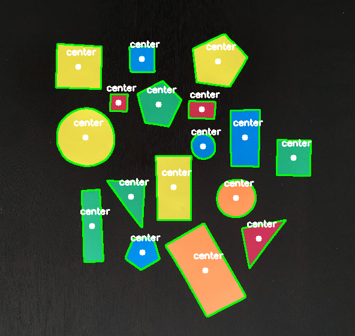

# Finding center of contour

This program aims to detect the middle part of shapes, outlines

simple steps:

- Conversion to grayscale.
- Blurring to reduce high frequency noise to make our contour detection process more accurate.
- Binarization of the image. Typically edge detection and thresholding are used for this process. In this post, we’ll be applying thresholding.

## treshold explanation

```
cv2.threshold(src, 60, 255, cv2.THRESH_BINARY)
```

simple explanation

- `src` is source the image
- `60` is treshold value (0-255)
- `255`  is maxValue, represents the value to be given if pixel value is more than (sometimes less than) the threshold value.
- `cv2.THRESH_BINARY` is the style, if the pixel greater than treshold value, it is assigned maxValue

another type like `cv2.THRESH_BINARY_INV` is the opposite

### for full explanation visit the documentation

- [docs](https://opencv-python-tutroals.readthedocs.io/en/latest/py_tutorials/py_imgproc/py_thresholding/py_thresholding.html) (full explanation) 


## find Contour

```
cv2.findContours(tresh.copy(), cv2.RETR_EXTERNAL,cv2.CHAIN_APPROX_SIMPLE)
```

simple example

- `tresh.copy()` is the source image (using image that has been tresholded)
- `cv2.RETR_EXTERNAL` retrieves only the extreme outer contours
- `cv2.CHAIN_APPROX_SIMPLE` compresses horizontal, vertical, and diagonal segments and leaves only their end points. For example, an up-right rectangular contour is encoded with 4 points.

### for full explanation visit the documentation

- [docs](https://docs.opencv.org/2.4/modules/imgproc/doc/structural_analysis_and_shape_descriptors.html) (full explanation)

## Run the code
```
$ python center-of-contour.py --image shape.jpg
```

## Image For Testing


## Output


