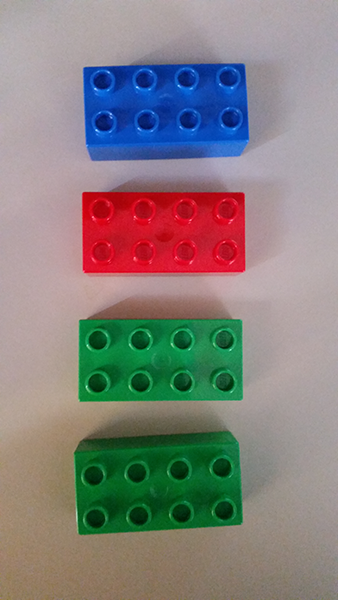
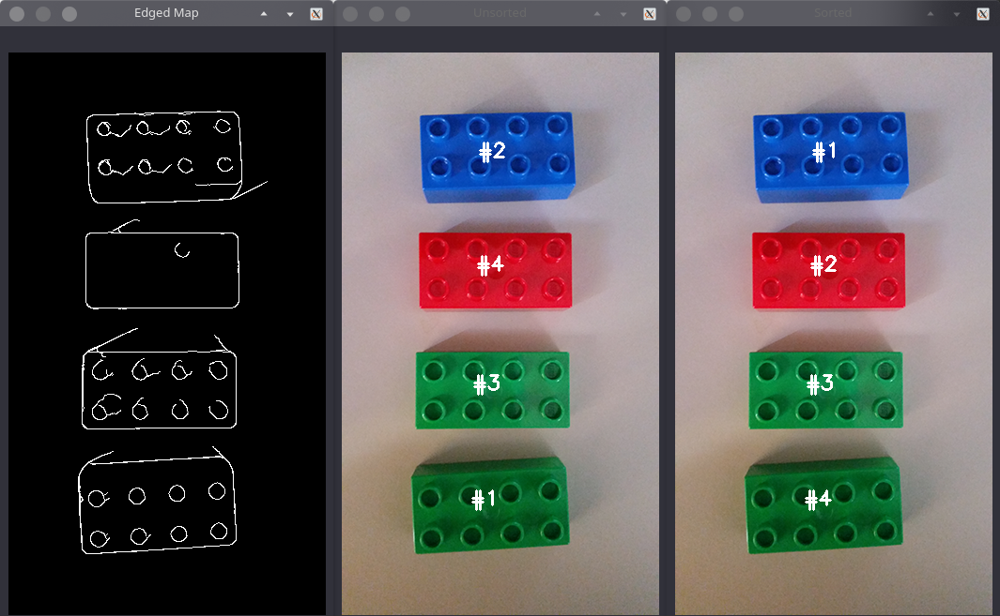

# Sorting Contours

## our goal:
- sorting contour with 4 method
    - left-to-right
    - top-to-buttom
    - right-to-top
    - buttom-to-top

## Run the code
```
$ python sorting-contour.py --image image_01.png --method top-to-buttom
```

## Image For Testing


## Output


## Source and full explanation
[pyimagesearch blog](https://www.pyimagesearch.com/2015/04/20/sorting-contours-using-python-and-opencv/)